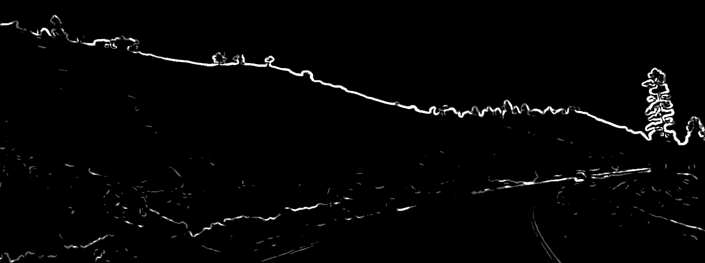

# GrabAndProcess
It takes one of your screens as an input, performing some post processing in runtime and displaying (yeah, you need at least 2 screens).

I just learnt about Cell Shading and wanted to implement it in some way.

Original

Edges

Cell Shading (Kuwahara)

Fish eye effect and original comparison

